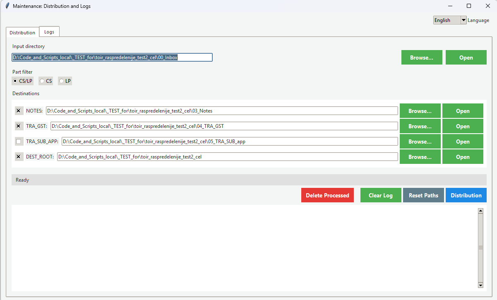

# TOIR PDF Distribution Manager

[English](README.md) | [Русский](README.ru.md)

A Windows-oriented Python utility for distributing maintenance PDF reports across destination folders, creating project archives, and recording every operation in JSONL logs. It includes a Tkinter desktop interface and a command-line log report.

> [!IMPORTANT]
> Each report must be placed in its own subfolder inside the input directory. If PDF files are found directly in the INBOX root, processing stops with a warning.

## Interface

The interface supports English and Russian. Use the language selector in the upper-right corner; the selection is saved for the next launch.

### Distribution

Configure the INBOX and destination folders, select the `CS`/`LP` part filter, enable the required destinations, and start distribution.



### Logs

Review previous runs, inspect operation status and paths, open destination folders, or remove old log files.


## Features

- Recursively finds project folders containing `_All.pdf` files.
- Parses report attributes from the filename.
- Supports `CS`, `LP`, or combined `CS/LP` filtering.
- Copies reports to NOTES, TRA_GST, TRA_SUB_APP, and the final PDF structure.
- Creates ZIP archives of source project folders in the `Native` structure.
- Writes thread-safe JSONL operation logs for the desktop UI and CLI.
- Remembers paths, destination toggles, the part filter, and the selected UI language.
- Prevents the desktop UI from starting when `APP_HEADLESS=1`.

## Requirements

- Python 3.10 or newer.
- `openpyxl` for reading `Template/TZ_glob.xlsx`.
- Tkinter, included with standard Windows Python installations.

Create and activate a virtual environment:

```powershell
python -m venv .venv
.\.venv\Scripts\Activate.ps1
python -m pip install openpyxl
```

For development and testing:

```powershell
python -m pip install pytest ruff black mypy types-openpyxl
```

## Quick start

Start the desktop application:

```powershell
python run_ui.py --base-dir logs/dispatch
```

Run the distribution pipeline directly:

```powershell
python toir_raspredelenije.py
```

Override the INBOX directory for one PowerShell session:

```powershell
$env:TOIR_INBOX_DIR = "D:\Reports\00_Inbox"
python toir_raspredelenije.py
```

Show the JSON log summary:

```powershell
$env:PYTHONPATH = "src"
python -m toir_manager report --base-dir logs/dispatch --json
```

## Input filename format

Report names must follow this pattern:

```text
CT-DR-B-<part>-<object>-<TZ>-<period>-<date>-<revision>_All.pdf
```

Example:

```text
CT-DR-B-CS-ES-II.2.6-00-C-20250812-02_All.pdf
```

Use Latin characters (`A-Z`, `0-9`) in report names. When Cyrillic characters are detected, the application attempts automatic transliteration. If a safe conversion is not possible, the anomaly is logged and the report is skipped.

## Processing workflow

1. The application recursively scans `INBOX_DIR` for project folders containing `_All.pdf`.
2. It parses the part, object, period, date, revision, and other filename attributes.
3. It applies the selected `TOIR_PART_FILTER`.
4. Enabled copies are written to NOTES, TRA_GST, TRA_SUB_APP, and `DEST_ROOT_DIR/pdf`.
5. A ZIP archive of the project folder is created and copied to `DEST_ROOT_DIR/Native`.
6. Every action is written to `logs/dispatch/<run_id>.jsonl`.

A project folder should contain only one `_All.pdf`. If several matching files are present, only the first one is processed.

## Directories and environment variables

| Variable | Purpose |
| --- | --- |
| `TOIR_INBOX_DIR` | Input directory. The project is the folder in which `_All.pdf` is found. |
| `TOIR_NOTES_DIR` | Destination for report copies used as notes. |
| `TOIR_TRA_GST_DIR` | Weekly structure using `YYYY_TWW_GST` folders. |
| `TOIR_TRA_SUB_APP_DIR` | Additional grouping based on `<tz_index>-<reserved>-<period>`. |
| `TOIR_DEST_ROOT_DIR` | Root of the final `Year/Month/Part/{pdf,Native}` structure. |
| `TOIR_TEMP_ARCHIVE_DIR` | Temporary directory used while ZIP archives are created. |
| `TOIR_DISPATCH_DIR` | JSONL log directory. The UI sets it automatically. |
| `TOIR_PART_FILTER` | Part filter: `LP`, `CS`, or `CS/LP`. Invalid values fall back to `CS/LP`. |
| `TOIR_ENABLE_NOTES` | Enables or disables NOTES distribution. |
| `TOIR_ENABLE_TRA_GST` | Enables or disables TRA_GST distribution. |
| `TOIR_ENABLE_TRA_SUB_APP` | Enables or disables TRA_SUB_APP distribution. |
| `TOIR_ENABLE_DEST_ROOT` | Enables or disables final PDF/Native distribution. |
| `APP_HEADLESS` | Set to `1` to prevent the graphical interface from starting. |

UI settings are stored in `~/.toir_manager/ui_paths.json`. On Windows this normally resolves to `%USERPROFILE%\.toir_manager\ui_paths.json`.

## Destination rules

- `TRA_GST_DIR` uses ISO week folders. If the expected folder already contains an archive, the application selects the next available week.
- `TRA_SUB_APP_DIR` uses `Template/TZ_glob.xlsx` for suffix lookup where required.
- `DEST_ROOT_DIR` creates a `Year/Month/<part>/{pdf,Native}` structure.
- Period `C` or Cyrillic `С` is routed to the existing `Корректирующее обслуживание` business folder.
- LP object suffixes are normalized by removing leading zeroes, for example `BVS05` becomes `BVS5`.
- CS folders are selected using configured prefixes such as `CS_FOLDER_OVERRIDES`; missing `pdf` and `Native` folders are created when required.

## Logs

Each pipeline run creates `logs/dispatch/<run_id>.jsonl`. The desktop Logs tab displays these records in a table. The CLI can produce a human-readable or JSON summary.

The desktop interface also provides:

- opening the selected or all destination folders;
- removing all log files except the latest one;
- deleting successfully processed INBOX project folders after confirmation;
- viewing stdout, warnings, and errors from the active run.

## Building the Windows executable

Install PyInstaller in the active virtual environment and build using the included specification:

```powershell
python -m pip install pyinstaller
pyinstaller ToirManager.spec --noconfirm
```

The executable is created at `dist/toir_raspredelenije.exe`. Double-click it to open the desktop interface or run the pipeline without the UI:

```powershell
.\dist\toir_raspredelenije.exe --run-pipeline
```

In the packaged application, distribution logs are created under `dist/logs/dispatch`.

## Project structure

```text
repo/
|- toir_raspredelenije.py      # distribution pipeline
|- run_ui.py                   # desktop entry point
|- ToirManager.spec            # PyInstaller configuration
|- src/toir_manager/
|  |- core/                    # domain and logging models
|  |- services/                # settings and log IO
|  |- cli/                     # command-line reports
|  |- ui/                      # Tkinter interface and translations
|- tests/                      # pytest suite
|- Template/                   # lookup workbook and templates
|- logs/dispatch/              # JSONL run logs
|- assets/                     # application icon and screenshots
```

## Validation

Run the project checks from the activated virtual environment:

```powershell
python -m ruff check src/toir_manager/ui/desktop.py src/toir_manager/ui/translations.py tests/test_ui_translations.py
python -m black --check .
python -m mypy src run_ui.py toir_raspredelenije.py tests
python -m pytest -q
```
